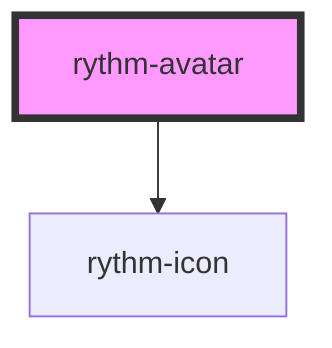

# rythm-avatar

<!-- Auto Generated Below -->

## Overview

Displays a user avatar with an image, initials, or icon as a fallback chain.

## Properties

| Property         | Attribute         | Description                                                                                                | Type                                                               | Default     |
| ---------------- | ----------------- | ---------------------------------------------------------------------------------------------------------- | ------------------------------------------------------------------ | ----------- |
| `alt`            | `alt`             | Accessible alt text for the image; also used as the host aria-label.                                       | `string \| undefined`                                              | `undefined` |
| `gradientBorder` | `gradient-border` | Decorative primary-to-secondary gradient ring, independent of color/variant.                               | `boolean`                                                          | `false`     |
| `icon`           | `icon`            | Lucide icon name used as the last fallback when no src or initials are provided.                           | `string`                                                           | `'user'`    |
| `initials`       | `initials`        | Up to two initials shown when no image is provided or it fails to load.                                    | `string \| undefined`                                              | `undefined` |
| `shape`          | `shape`           | Shape of the avatar container. Reflected to a host attribute so the gradient-border ring CSS can match it. | `"circle" \| "square"`                                             | `'circle'`  |
| `size`           | `size`            | Visual size.                                                                                               | `"2xl" \| "3xl" \| "base" \| "lg" \| "md" \| "sm" \| "xl" \| "xs"` | `'md'`      |
| `src`            | `src`             | Image URL.                                                                                                 | `string \| undefined`                                              | `undefined` |

## Shadow Parts

| Part       | Description              |
| ---------- | ------------------------ |
| `"avatar"` | The inner container div. |

## Dependencies

### Depends on

- [rythm-icon](../icon)

### Graph

----------------------------------------------

*Built with [StencilJS](https://stenciljs.com/)*
