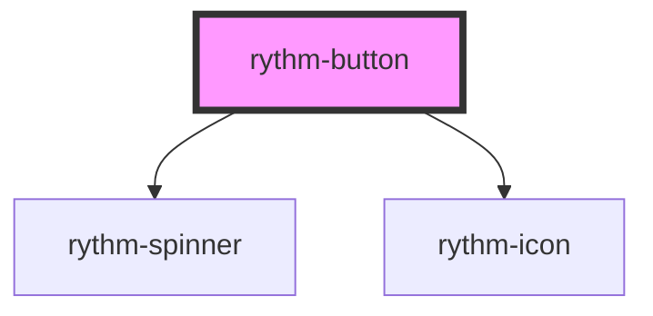

# rythm-button

<!-- Auto Generated Below -->

## Overview

Interactive button with multiple variants, colors, sizes, icon slots, and loading state.
Renders as an `<a>` element when `href` is provided.

## Properties

| Property         | Attribute         | Description                                                                    | Type                                                                                                                       | Default     |
| ---------------- | ----------------- | ------------------------------------------------------------------------------ | -------------------------------------------------------------------------------------------------------------------------- | ----------- |
| `color`          | `color`           | Color intent.                                                                  | `"danger" \| "neutral" \| "primary" \| "secondary" \| "success" \| "warning"`                                              | `'primary'` |
| `disabled`       | `disabled`        | Disables interaction and applies disabled styling.                             | `boolean`                                                                                                                  | `false`     |
| `gradientBorder` | `gradient-border` | Decorative primary-to-secondary gradient ring, independent of color/variant.   | `boolean`                                                                                                                  | `false`     |
| `href`           | `href`            | Renders the button as an anchor element pointing to this URL.                  | `string \| undefined`                                                                                                      | `undefined` |
| `iconEnd`        | `icon-end`        | Icon name (from rythm-icon registry) rendered after the label.                 | `string \| undefined`                                                                                                      | `undefined` |
| `iconOnly`       | `icon-only`       | Square icon-only button — requires an `aria-label` on the host element.        | `boolean`                                                                                                                  | `false`     |
| `iconStart`      | `icon-start`      | Icon name (from rythm-icon registry) rendered before the label.                | `string \| undefined`                                                                                                      | `undefined` |
| `loading`        | `loading`         | Shows a spinner and prevents interaction while an async action is in progress. | `boolean`                                                                                                                  | `false`     |
| `size`           | `size`            | Visual size.                                                                   | `"2xl" \| "3xl" \| "base" \| "lg" \| "md" \| "sm" \| "xl" \| "xs"`                                                         | `'md'`      |
| `sound`          | `sound`           | Override the sound played by this component instance.                          | `"click" \| "close" \| "error" \| "hover" \| "open" \| "success" \| "toggle-off" \| "toggle-on" \| "warning" \| undefined` | `undefined` |
| `target`         | `target`          | Anchor `target` attribute; applied only when `href` is set.                    | `string \| undefined`                                                                                                      | `undefined` |
| `type`           | `type`            | Native button `type` attribute.                                                | `"button" \| "reset" \| "submit"`                                                                                          | `'button'`  |
| `variant`        | `variant`         | Visual style variant.                                                          | `"ghost" \| "link" \| "outline" \| "solid"`                                                                                | `'solid'`   |

## Events

| Event        | Description                                                     | Type                      |
| ------------ | --------------------------------------------------------------- | ------------------------- |
| `rythmClick` | Fired on click when the button is neither disabled nor loading. | `CustomEvent<MouseEvent>` |

## Dependencies

### Depends on

- [rythm-spinner](../spinner)
- [rythm-icon](../icon)

### Graph

----------------------------------------------

*Built with [StencilJS](https://stenciljs.com/)*
