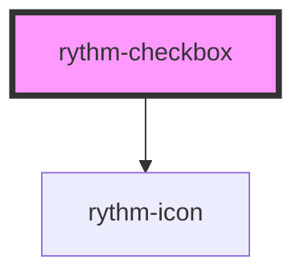

# rythm-checkbox

<!-- Auto Generated Below -->

## Overview

Accessible checkbox with indeterminate state and optional sound feedback.

## Properties

| Property        | Attribute       | Description                                                                                                                           | Type                  | Default     |
| --------------- | --------------- | ------------------------------------------------------------------------------------------------------------------------------------- | --------------------- | ----------- |
| `checked`       | `checked`       | Whether the checkbox is checked.                                                                                                      | `boolean`             | `false`     |
| `disabled`      | `disabled`      | Disables interaction and applies disabled styling.                                                                                    | `boolean`             | `false`     |
| `indeterminate` | `indeterminate` | Indeterminate state — visually distinct from checked/unchecked. Setting this to `false` after user interaction is handled internally. | `boolean`             | `false`     |
| `label`         | `label`         | Accessible label text. Falls back to slotted content when omitted.                                                                    | `string \| undefined` | `undefined` |
| `name`          | `name`          | Form field name.                                                                                                                      | `string \| undefined` | `undefined` |
| `required`      | `required`      | Marks the field as required.                                                                                                          | `boolean`             | `false`     |
| `value`         | `value`         | Value submitted with the form when checked.                                                                                           | `string \| undefined` | `undefined` |

## Events

| Event         | Description                           | Type                   |
| ------------- | ------------------------------------- | ---------------------- |
| `rythmChange` | Fired when the checked state changes. | `CustomEvent<boolean>` |

## Dependencies

### Depends on

- [rythm-icon](../icon)

### Graph

----------------------------------------------

*Built with [StencilJS](https://stenciljs.com/)*
