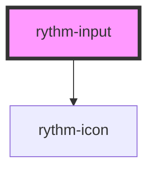

# rythm-input

<!-- Auto Generated Below -->

## Overview

Accessible text input with label, hint, error, icon slots, password visibility
toggle, and clearable support.

## Properties

| Property       | Attribute      | Description                                                                          | Type                                                                        | Default     |
| -------------- | -------------- | ------------------------------------------------------------------------------------ | --------------------------------------------------------------------------- | ----------- |
| `autocomplete` | `autocomplete` | Native `autocomplete` attribute.                                                     | `string \| undefined`                                                       | `undefined` |
| `clearable`    | `clearable`    | Shows a clear (×) button when the field has a value.                                 | `boolean`                                                                   | `false`     |
| `disabled`     | `disabled`     | Disables the input.                                                                  | `boolean`                                                                   | `false`     |
| `error`        | `error`        | Error message — sets `aria-invalid` and renders below the input with `role="alert"`. | `string \| undefined`                                                       | `undefined` |
| `hint`         | `hint`         | Helper text displayed below the input when there is no error.                        | `string \| undefined`                                                       | `undefined` |
| `iconEnd`      | `icon-end`     | Lucide icon name displayed at the end of the field.                                  | `string \| undefined`                                                       | `undefined` |
| `iconStart`    | `icon-start`   | Lucide icon name displayed at the start of the field.                                | `string \| undefined`                                                       | `undefined` |
| `label`        | `label`        | Visible label text rendered above the input.                                         | `string \| undefined`                                                       | `undefined` |
| `name`         | `name`         | Form field name.                                                                     | `string \| undefined`                                                       | `undefined` |
| `noSound`      | `no-sound`     | Suppress sound feedback for this instance.                                           | `boolean`                                                                   | `false`     |
| `placeholder`  | `placeholder`  | Placeholder text shown when the field is empty.                                      | `string \| undefined`                                                       | `undefined` |
| `readonly`     | `readonly`     | Makes the input read-only.                                                           | `boolean`                                                                   | `false`     |
| `required`     | `required`     | Marks the field as required.                                                         | `boolean`                                                                   | `false`     |
| `size`         | `size`         | Visual size variant.                                                                 | `"lg" \| "md" \| "sm"`                                                      | `'md'`      |
| `type`         | `type`         | Input type. Changing to `password` enables the show/hide toggle.                     | `"email" \| "number" \| "password" \| "search" \| "tel" \| "text" \| "url"` | `'text'`    |
| `value`        | `value`        | Controlled value of the input.                                                       | `string`                                                                    | `''`        |

## Events

| Event         | Description                                                                  | Type                  |
| ------------- | ---------------------------------------------------------------------------- | --------------------- |
| `rythmBlur`   | Fired when the input loses focus.                                            | `CustomEvent<void>`   |
| `rythmChange` | Fired when the value is committed (equivalent to the native `change` event). | `CustomEvent<string>` |
| `rythmClear`  | Fired when the clear button is clicked.                                      | `CustomEvent<void>`   |
| `rythmFocus`  | Fired when the input receives focus.                                         | `CustomEvent<void>`   |
| `rythmInput`  | Fired on every keystroke.                                                    | `CustomEvent<string>` |

## Dependencies

### Depends on

- [rythm-icon](../icon)

### Graph

----------------------------------------------

*Built with [StencilJS](https://stenciljs.com/)*
