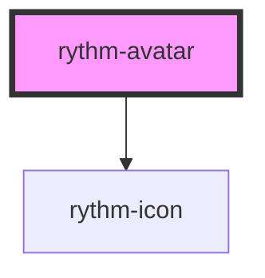

# rythm-avatar

<!-- Auto Generated Below -->

## Properties

| Property   | Attribute  | Description                                                                        | Type                                            | Default     |
| ---------- | ---------- | ---------------------------------------------------------------------------------- | ----------------------------------------------- | ----------- |
| `alt`      | `alt`      |                                                                                    | `string \| undefined`                           | `undefined` |
| `icon`     | `icon`     | Lucide icon name used as fallback when no src or initials are provided             | `string`                                        | `'user'`    |
| `initials` | `initials` | Up to two initials shown as fallback when no image is provided or it fails to load | `string \| undefined`                           | `undefined` |
| `shape`    | `shape`    | Shape: circle (default) or square                                                  | `"circle" \| "square"`                          | `'circle'`  |
| `size`     | `size`     |                                                                                    | `"2xl" \| "lg" \| "md" \| "sm" \| "xl" \| "xs"` | `'md'`      |
| `src`      | `src`      |                                                                                    | `string \| undefined`                           | `undefined` |

## Dependencies

### Depends on

- [rythm-icon](../rythm-icon)

### Graph

----------------------------------------------

*Built with [StencilJS](https://stenciljs.com/)*
