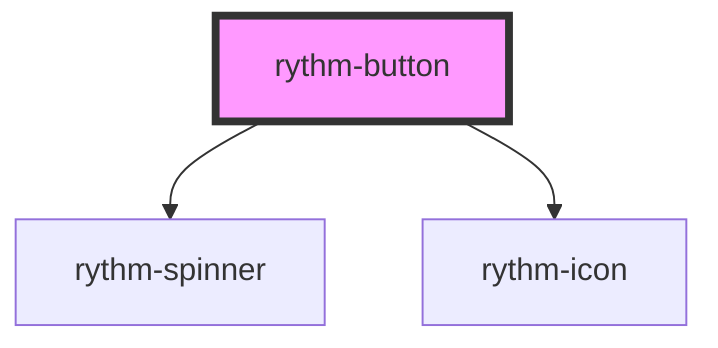

# rythm-button

<!-- Auto Generated Below -->

## Properties

| Property    | Attribute    | Description                                                    | Type                                                                          | Default     |
| ----------- | ------------ | -------------------------------------------------------------- | ----------------------------------------------------------------------------- | ----------- |
| `color`     | `color`      |                                                                | `"danger" \| "neutral" \| "primary" \| "secondary" \| "success" \| "warning"` | `'primary'` |
| `disabled`  | `disabled`   |                                                                | `boolean`                                                                     | `false`     |
| `href`      | `href`       |                                                                | `string \| undefined`                                                         | `undefined` |
| `iconEnd`   | `icon-end`   | Icon name rendered after the label                             | `string \| undefined`                                                         | `undefined` |
| `iconOnly`  | `icon-only`  | Square icon-only button — requires an aria-label on the host   | `boolean`                                                                     | `false`     |
| `iconStart` | `icon-start` | Icon name (from rythm-icon registry) rendered before the label | `string \| undefined`                                                         | `undefined` |
| `loading`   | `loading`    |                                                                | `boolean`                                                                     | `false`     |
| `noSound`   | `no-sound`   | Suppress sound for this instance                               | `boolean`                                                                     | `false`     |
| `size`      | `size`       |                                                                | `"lg" \| "md" \| "sm" \| "xl" \| "xs"`                                        | `'md'`      |
| `target`    | `target`     |                                                                | `string \| undefined`                                                         | `undefined` |
| `type`      | `type`       |                                                                | `"button" \| "reset" \| "submit"`                                             | `'button'`  |
| `variant`   | `variant`    |                                                                | `"ghost" \| "link" \| "outline" \| "solid"`                                   | `'solid'`   |

## Events

| Event        | Description | Type                      |
| ------------ | ----------- | ------------------------- |
| `rythmClick` |             | `CustomEvent<MouseEvent>` |

## Dependencies

### Depends on

- [rythm-spinner](../rythm-spinner)
- [rythm-icon](../rythm-icon)

### Graph

----------------------------------------------

*Built with [StencilJS](https://stenciljs.com/)*
