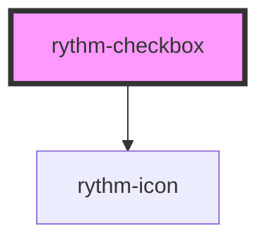

# rythm-checkbox

<!-- Auto Generated Below -->

## Properties

| Property        | Attribute       | Description                                                    | Type                  | Default     |
| --------------- | --------------- | -------------------------------------------------------------- | --------------------- | ----------- |
| `checked`       | `checked`       |                                                                | `boolean`             | `false`     |
| `disabled`      | `disabled`      |                                                                | `boolean`             | `false`     |
| `indeterminate` | `indeterminate` | Indeterminate state — visually distinct from checked/unchecked | `boolean`             | `false`     |
| `label`         | `label`         |                                                                | `string \| undefined` | `undefined` |
| `name`          | `name`          |                                                                | `string \| undefined` | `undefined` |
| `noSound`       | `no-sound`      |                                                                | `boolean`             | `false`     |
| `required`      | `required`      |                                                                | `boolean`             | `false`     |
| `value`         | `value`         |                                                                | `string \| undefined` | `undefined` |

## Events

| Event         | Description | Type                   |
| ------------- | ----------- | ---------------------- |
| `rythmChange` |             | `CustomEvent<boolean>` |

## Dependencies

### Depends on

- [rythm-icon](../rythm-icon)

### Graph

----------------------------------------------

*Built with [StencilJS](https://stenciljs.com/)*
