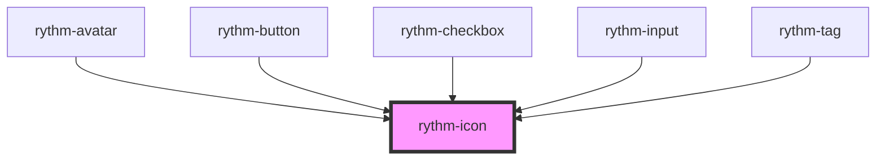

# rythm-icon

<!-- Auto Generated Below -->

## Overview

Renders a single icon from the Rythm icon registry as an inline SVG.
When `label` is omitted the icon is treated as decorative and hidden from
assistive technology.

## Properties

| Property            | Attribute | Description                                                                                                              | Type                                   | Default     |
| ------------------- | --------- | ------------------------------------------------------------------------------------------------------------------------ | -------------------------------------- | ----------- |
| `label`             | `label`   | Accessible label announced by screen readers. Omit for decorative icons — the element will be aria-hidden automatically. | `string \| undefined`                  | `undefined` |
| `name` _(required)_ | `name`    | Name of the icon from the Rythm icon registry.                                                                           | `string`                               | `undefined` |
| `size`              | `size`    | Visual size.                                                                                                             | `"lg" \| "md" \| "sm" \| "xl" \| "xs"` | `'md'`      |

## Dependencies

### Used by

 - [rythm-avatar](../rythm-avatar)
 - [rythm-button](../rythm-button)
 - [rythm-checkbox](../rythm-checkbox)
 - [rythm-input](../rythm-input)
 - [rythm-tag](../rythm-tag)

### Graph

----------------------------------------------

*Built with [StencilJS](https://stenciljs.com/)*
