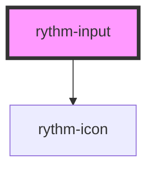

# rythm-input

<!-- Auto Generated Below -->

## Properties

| Property       | Attribute      | Description                                             | Type                                                                        | Default     |
| -------------- | -------------- | ------------------------------------------------------- | --------------------------------------------------------------------------- | ----------- |
| `autocomplete` | `autocomplete` |                                                         | `string \| undefined`                                                       | `undefined` |
| `clearable`    | `clearable`    | Shows a clear (×) button when the field has a value     | `boolean`                                                                   | `false`     |
| `disabled`     | `disabled`     |                                                         | `boolean`                                                                   | `false`     |
| `error`        | `error`        | Error message — sets aria-invalid and shows below input | `string \| undefined`                                                       | `undefined` |
| `hint`         | `hint`         | Helper text below the input                             | `string \| undefined`                                                       | `undefined` |
| `iconEnd`      | `icon-end`     | Lucide icon name displayed at the end                   | `string \| undefined`                                                       | `undefined` |
| `iconStart`    | `icon-start`   | Lucide icon name displayed at the start                 | `string \| undefined`                                                       | `undefined` |
| `label`        | `label`        |                                                         | `string \| undefined`                                                       | `undefined` |
| `name`         | `name`         |                                                         | `string \| undefined`                                                       | `undefined` |
| `noSound`      | `no-sound`     |                                                         | `boolean`                                                                   | `false`     |
| `placeholder`  | `placeholder`  |                                                         | `string \| undefined`                                                       | `undefined` |
| `readonly`     | `readonly`     |                                                         | `boolean`                                                                   | `false`     |
| `required`     | `required`     |                                                         | `boolean`                                                                   | `false`     |
| `size`         | `size`         |                                                         | `"lg" \| "md" \| "sm"`                                                      | `'md'`      |
| `type`         | `type`         |                                                         | `"email" \| "number" \| "password" \| "search" \| "tel" \| "text" \| "url"` | `'text'`    |
| `value`        | `value`        |                                                         | `string`                                                                    | `''`        |

## Events

| Event         | Description | Type                  |
| ------------- | ----------- | --------------------- |
| `rythmBlur`   |             | `CustomEvent<void>`   |
| `rythmChange` |             | `CustomEvent<string>` |
| `rythmClear`  |             | `CustomEvent<void>`   |
| `rythmFocus`  |             | `CustomEvent<void>`   |
| `rythmInput`  |             | `CustomEvent<string>` |

## Dependencies

### Depends on

- [rythm-icon](../rythm-icon)

### Graph

----------------------------------------------

*Built with [StencilJS](https://stenciljs.com/)*
