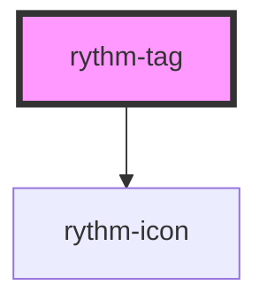

# rythm-tag

<!-- Auto Generated Below -->

## Overview

Compact label chip with optional dismiss action.

## Properties

| Property      | Attribute     | Description                                | Type                                                                          | Default     |
| ------------- | ------------- | ------------------------------------------ | ----------------------------------------------------------------------------- | ----------- |
| `color`       | `color`       | Color intent.                              | `"danger" \| "neutral" \| "primary" \| "secondary" \| "success" \| "warning"` | `'neutral'` |
| `dismissible` | `dismissible` | Shows a dismiss button inside the tag.     | `boolean`                                                                     | `false`     |
| `noSound`     | `no-sound`    | Suppress sound feedback for this instance. | `boolean`                                                                     | `false`     |

## Events

| Event          | Description                               | Type                |
| -------------- | ----------------------------------------- | ------------------- |
| `rythmDismiss` | Fired when the dismiss button is clicked. | `CustomEvent<void>` |

## Dependencies

### Depends on

- [rythm-icon](../rythm-icon)

### Graph

----------------------------------------------

*Built with [StencilJS](https://stenciljs.com/)*
