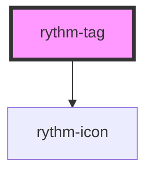

# rythm-tag

<!-- Auto Generated Below -->

## Properties

| Property      | Attribute     | Description | Type                                                                          | Default     |
| ------------- | ------------- | ----------- | ----------------------------------------------------------------------------- | ----------- |
| `color`       | `color`       |             | `"danger" \| "neutral" \| "primary" \| "secondary" \| "success" \| "warning"` | `'neutral'` |
| `dismissible` | `dismissible` |             | `boolean`                                                                     | `false`     |
| `noSound`     | `no-sound`    |             | `boolean`                                                                     | `false`     |

## Events

| Event          | Description | Type                |
| -------------- | ----------- | ------------------- |
| `rythmDismiss` |             | `CustomEvent<void>` |

## Dependencies

### Depends on

- [rythm-icon](../rythm-icon)

### Graph

----------------------------------------------

*Built with [StencilJS](https://stenciljs.com/)*
