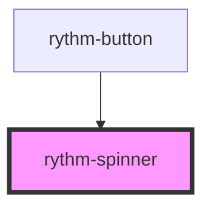

# rythm-spinner

<!-- Auto Generated Below -->

## Overview

Animated SVG arc loading indicator. Announces its label to screen readers
via `role="status"`.

## Properties

| Property | Attribute | Description                                   | Type                                   | Default      |
| -------- | --------- | --------------------------------------------- | -------------------------------------- | ------------ |
| `label`  | `label`   | Accessible label announced to screen readers. | `string`                               | `'Loading…'` |
| `size`   | `size`    | Visual size of the spinner.                   | `"lg" \| "md" \| "sm" \| "xl" \| "xs"` | `'md'`       |

## Dependencies

### Used by

 - [rythm-button](../button)

### Graph

----------------------------------------------

*Built with [StencilJS](https://stenciljs.com/)*
